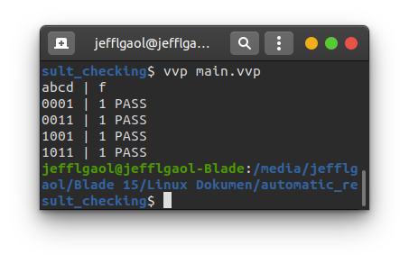

# Automatic Result Checking
This is an automatic result checking implementation to test a device with behavior:
```
minterm = 1,3,9,11
```
## How to compile?
```
$ iverilog -o main.vvp main.v
```

## How to observe output?
```
$ vvp main.vvp
$ gtkwave <<dumpfile name>>.vcd
```
## Timing diagram
