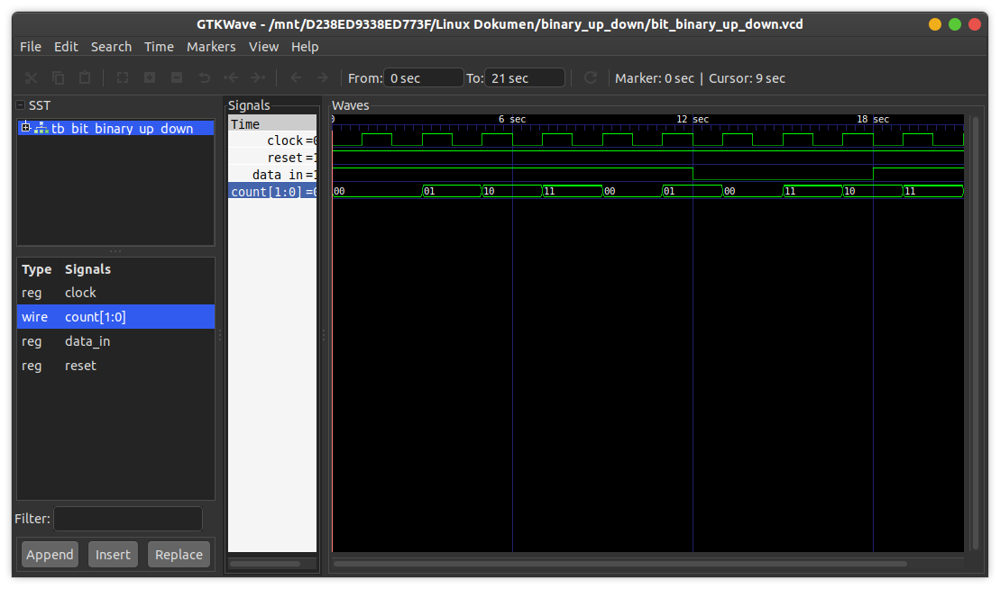

# 2 Bit Binary Up Down Counter
This is a binary up down counter (2-bit) implementation using a sequential implementation.

## How to compile?
```
$ iverilog -o main.vvp main.v
```

## How to observe output?
```
$ vvp main.vvp
$ gtkwave <<dumpfile name>>.vcd
```
## Timing diagram
