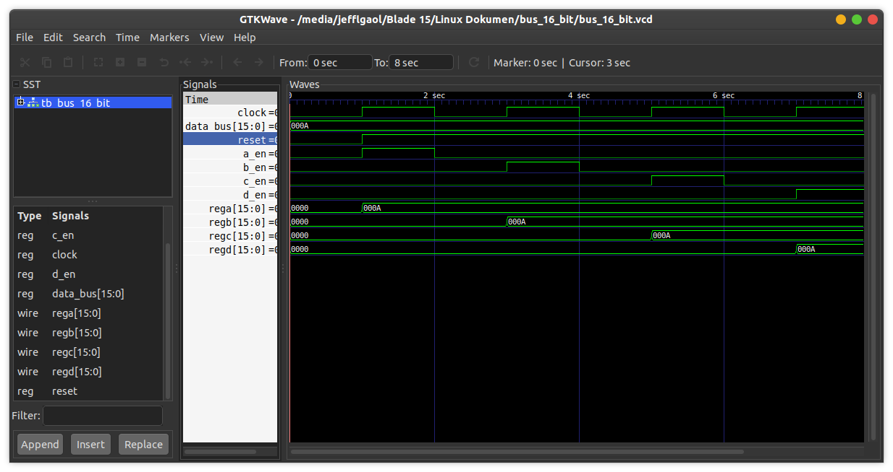

# Shift Register
This is a bus (16-bit) implementation equipped with four registers (16-bit).

## How to compile?
```
$ iverilog -o main.vvp main.v
```

## How to observe output?
```
$ vvp main.vvp
$ gtkwave <<dumpfile name>>.vcd
```
## Timing diagram
