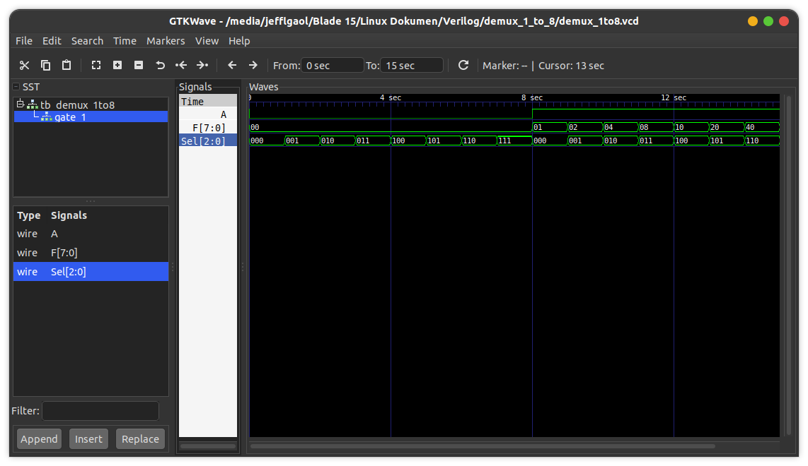

# Demux 1-to-8
This is a demultiplexer implementation using a conditional statement (ternary operator) in a continuous assignment technique.

Truth table:
| Sel2 | Sel1 | Sel0 | F7 | F6 | F5 | F4 | F3 | F2 | F1 | F0 |
|------|------|------|----|----|----|----|----|----|----|----|
| 0    | 0    | 0    | 0  | 0  | 0  | 0  | 0  | 0  | 0  | A  |
| 0    | 0    | 1    | 0  | 0  | 0  | 0  | 0  | 0  | A  | 0  |
| 0    | 1    | 0    | 0  | 0  | 0  | 0  | 0  | A  | 0  | 0  |
| 0    | 1    | 1    | 0  | 0  | 0  | 0  | A  | 0  | 0  | 0  |
| 1    | 0    | 0    | 0  | 0  | 0  | A  | 0  | 0  | 0  | 0  |
| 1    | 0    | 1    | 0  | 0  | A  | 0  | 0  | 0  | 0  | 0  |
| 1    | 1    | 0    | 0  | A  | 0  | 0  | 0  | 0  | 0  | 0  |
| 1    | 1    | 1    | A  | 0  | 0  | 0  | 0  | 0  | 0  | 0  |

## How to compile?
```
$ iverilog -o main.vvp main.v
```

## How to observe output?
```
$ vvp main.vvp
$ gtkwave <<dumpfile name>>.vcd
```
## Timing diagram

