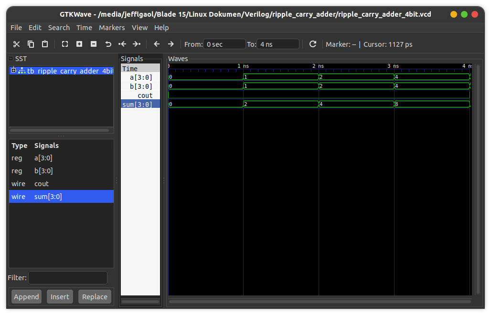

# Ripple Carry Adder
This is a structural/gate-level implementation in a continuous assignment technique to create a ripple carry adder device (4-bit).

## How to compile?
```
$ iverilog -o main.vvp main.v
```

## How to observe output?
```
$ vvp main.vvp
$ gtkwave <<dumpfile name>>.vcd
```
## Timing diagram
