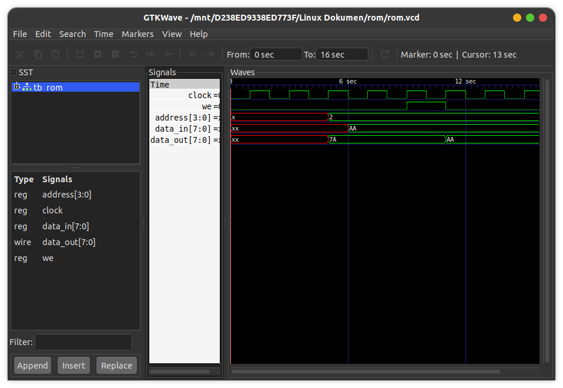

# Read/Write Memory
This is a read/write memory implementation (synchronous), which initializes the memory from an external file.

## How to compile?
```
$ iverilog -o main.vvp main.v
```

## How to observe output?
```
$ vvp main.vvp
$ gtkwave <<dumpfile name>>.vcd
```
## Timing diagram
