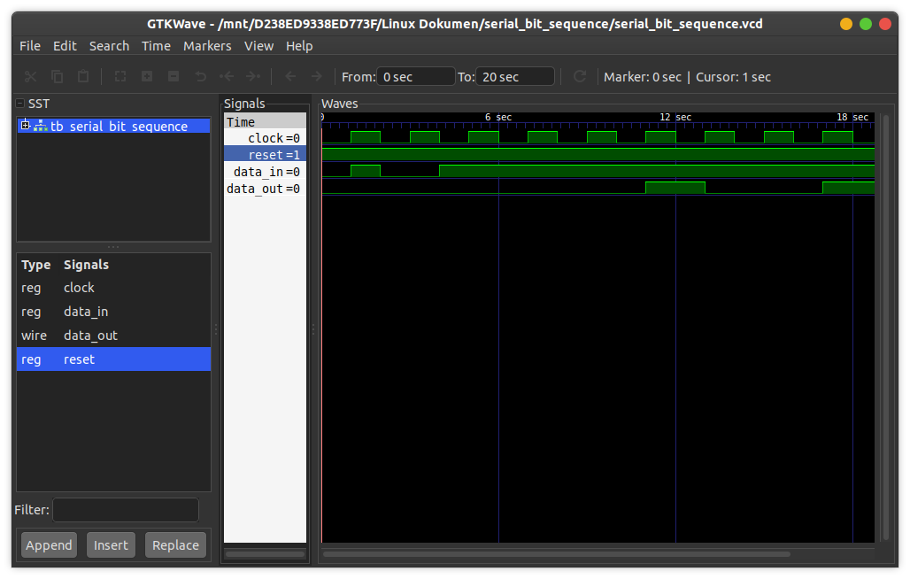

# Serial Bit Sequence
This is a serial bit sequence detector using a non-blocking assignment. If the detector finds 3'b111, then it will generate Out = 1.

## How to compile?
```
$ iverilog -o main.vvp main.v
```

## How to observe output?
```
$ vvp main.vvp
$ gtkwave <<dumpfile name>>.vcd
```
## Timing diagram
