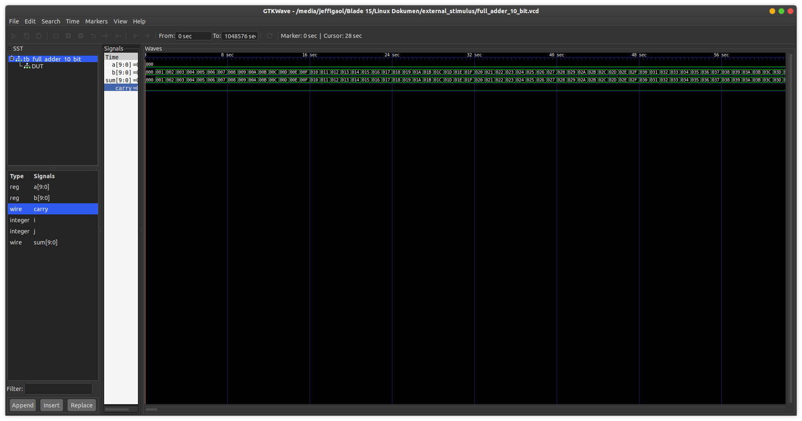

# Stimulus From Text
This is a demo of to add stimulus from external txt file to create a full-adder device (10-bit).

## How to compile?
```
$ iverilog -o main.vvp main.v
```

## How to observe output?
```
$ vvp main.vvp
$ gtkwave <<dumpfile name>>.vcd
```
## Timing diagram
