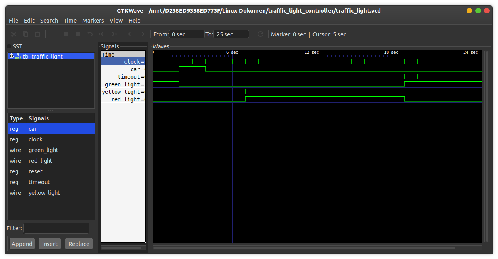

# Traffic Light Controller
This is a traffic light controller with this behavior:
- Car pulls up --> input signal 'Car' will be asserted
- 'Car' --> change from green -> yellow -> red.
- After a certain time --> input signal 'Timeout' will be asserted.
- 'Timeout' --> change from red -> green.

## How to compile?
```
$ iverilog -o main.vvp main.v
```

## How to observe output?
```
$ vvp main.vvp
$ gtkwave <<dumpfile name>>.vcd
```
## Timing diagram
