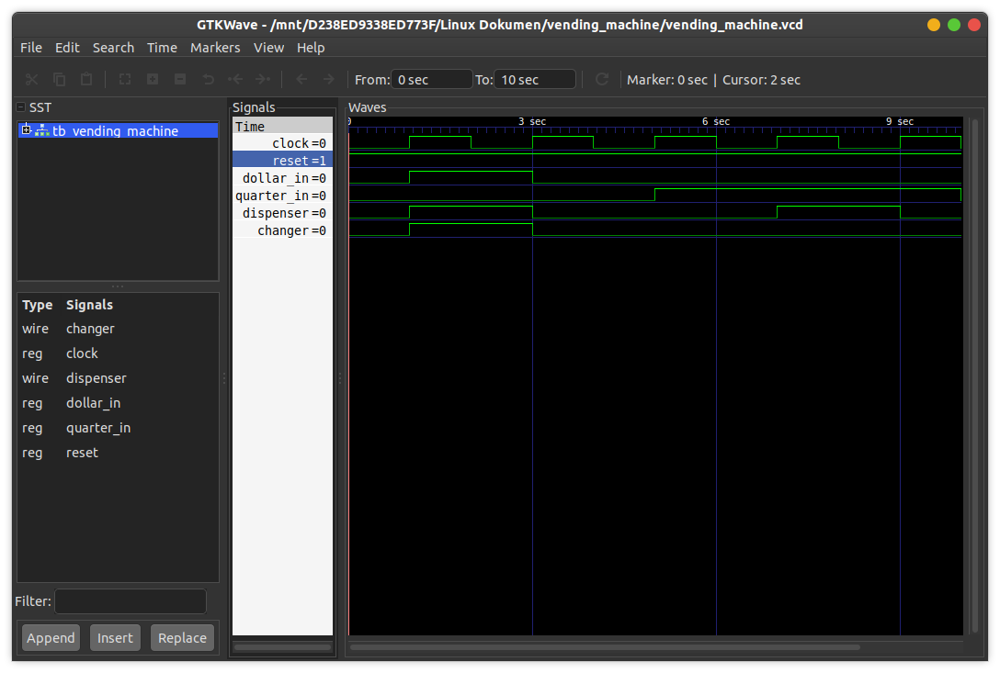

# Vending Machine
This is a vending machine implementation which sells 75 cents candy. The acceptable input is one dollar and a quarter, and the outputs is candy dispenser and change.

## How to compile?
```
$ iverilog -o main.vvp main.v
```

## How to observe output?
```
$ vvp main.vvp
$ gtkwave <<dumpfile name>>.vcd
```
## Timing diagram
